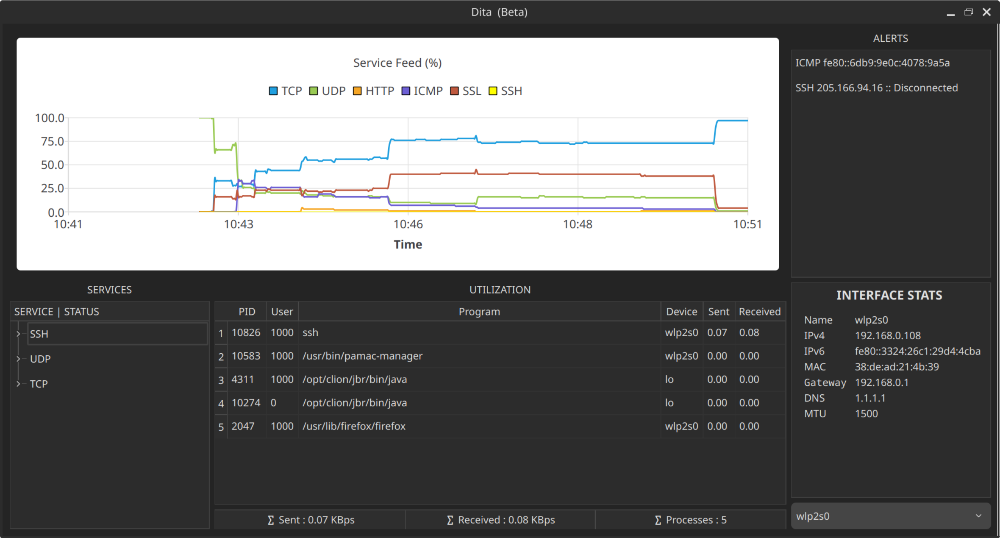
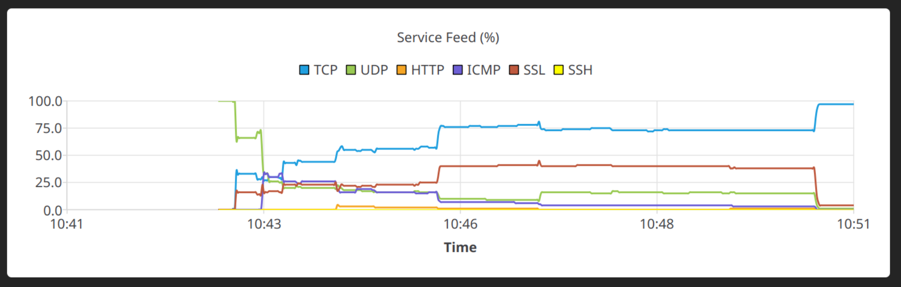
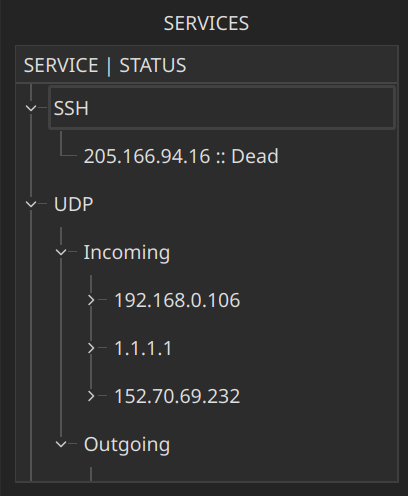

# Dita
Dita is an open-source,lightweight network monitoring and analysis tool designed to help
network administrators and developers monitor and analyze network traffic
in real-time. It provides detailed insights into network traffic, identifies potential
traffics, and helps in monitoring network-related problems.

## Overview 


### - Activity graph 


### - Services Info


## Build Instructions:
- Requirements: \
  &nbsp;&nbsp;&nbsp;&nbsp;&nbsp;&nbsp; cmake >=3.28 \
  &nbsp;&nbsp;&nbsp;&nbsp;&nbsp;&nbsp; Qt >=6 \
  &nbsp;&nbsp;&nbsp;&nbsp;&nbsp;&nbsp; PcapPlusPlus \
  &nbsp;&nbsp;&nbsp;&nbsp;&nbsp;&nbsp; libpcap 
- Build: 
```
$ vcpkg install qt libpcap pcapplusplus ncurses
```
```
$ cmake -S . -B build
```
- Run (as root): 
```
cd build
sudo ./Dita
```

## Running without root
Dita does not require root. Packet capture only needs `CAP_NET_RAW`
(promiscuous mode additionally needs `CAP_NET_ADMIN`, and mapping network
sockets to processes needs `CAP_DAC_READ_SEARCH` + `CAP_SYS_PTRACE`).
Grant the binary those capabilities once, then run it normally:
```
sudo setcap cap_net_raw,cap_net_admin,cap_dac_read_search,cap_sys_ptrace+ep build/Dita
./build/Dita
```
Note: file capabilities are lost if the binary is copied or moved -
re-run `setcap` afterwards. Alternative (capture only, no per-process
table for other users, re-login required):
```
sudo usermod -aG pcap $USER
```
If no capture permission is detected at startup, Dita shows a dialog
explaining the options. Without `CAP_NET_ADMIN` it falls back to
non-promiscuous capture; without `CAP_DAC_READ_SEARCH` +
`CAP_SYS_PTRACE` the per-process table only lists your own processes.

#### References:
[PcapPlusplus](https://pcapplusplus.github.io/) \
[nethogs](https://github.com/raboof/nethogs)
