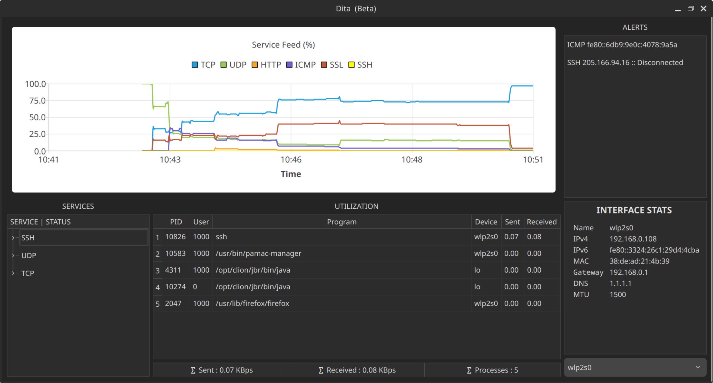

# Dita (Beta)
Dita is an open-source,lightweight network monitoring and analysis tool designed to help
network administrators and developers monitor and analyze network traffic
in real-time. It provides detailed insights into network traffic, identifies potential
traffics, and helps in monitoring network-related problems.

## Overview 


### - Activity graph 


### - Services Info


## Build Instructions:
- Requirements: \
  &nbsp;&nbsp;&nbsp;&nbsp;&nbsp;&nbsp; cmake >=3.28 \
  &nbsp;&nbsp;&nbsp;&nbsp;&nbsp;&nbsp; Qt >=6 \
  &nbsp;&nbsp;&nbsp;&nbsp;&nbsp;&nbsp; PcapPlusPlus \
  &nbsp;&nbsp;&nbsp;&nbsp;&nbsp;&nbsp; libpcap 
- Build: 
```
$ vcpkg install qt libpcap pcapplusplus ncurses
```
```
$ cmake -S . -B build
```
- Run: 
```
cd build
sudo ./dita
```

#### References:
[PcapPlusplus](https://pcapplusplus.github.io/) \
[nethogs](https://github.com/raboof/nethogs)
